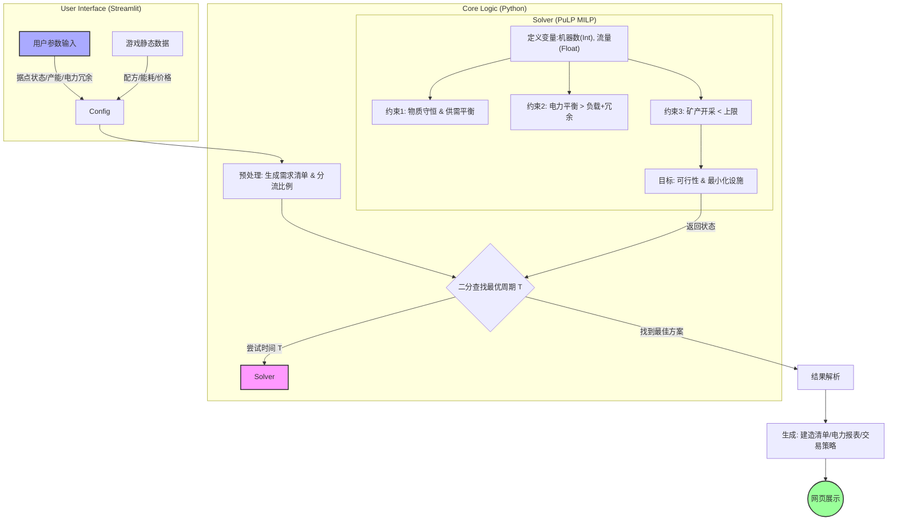

# 🏭 Endfield Industry Planner (明日方舟终末地工业规划器)

这是一个基于 MILP (混合整数线性规划) 算法的明日方舟终末地产线自动化规划工具。
由 **圆锥** 开发。

## 🧮 算法流程



## 🛠️ 功能特点
- **自动规划**：基于目标产能，自动计算最优设备配比。
- **电力平衡**：自动计算总耗电与发电设备需求。
- **收益最大化**：使用线性规划求解器 (PuLP) 计算单位时间最大收益。

## 📦 技术栈
- Python 3.9+
- Streamlit (Web UI)
- Pandas & PuLP (算法求解)

## 🚀 在线运行
点击下方链接直接使用（无需安装）：
[Planner](https://atbzigcbev2hyy7kwwhjhl.streamlit.app/)

## 💻 本地运行
```bash
pip install -r requirements.txt
streamlit run EndfeildPlanner.py
